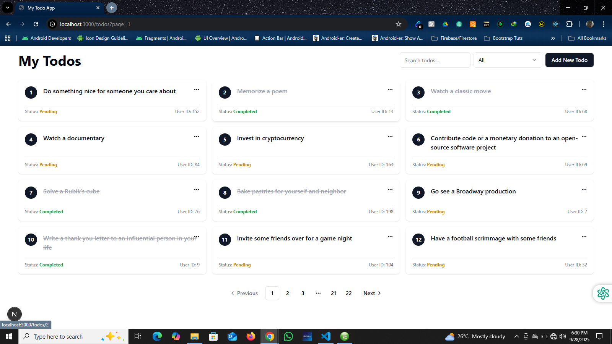
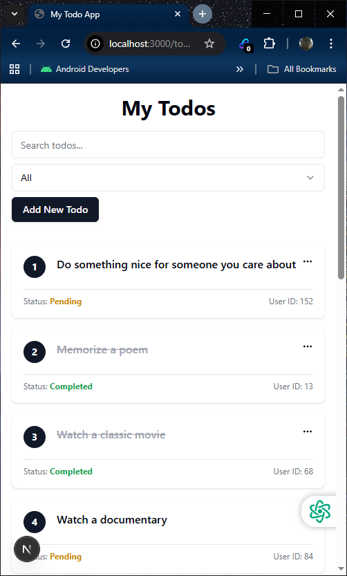
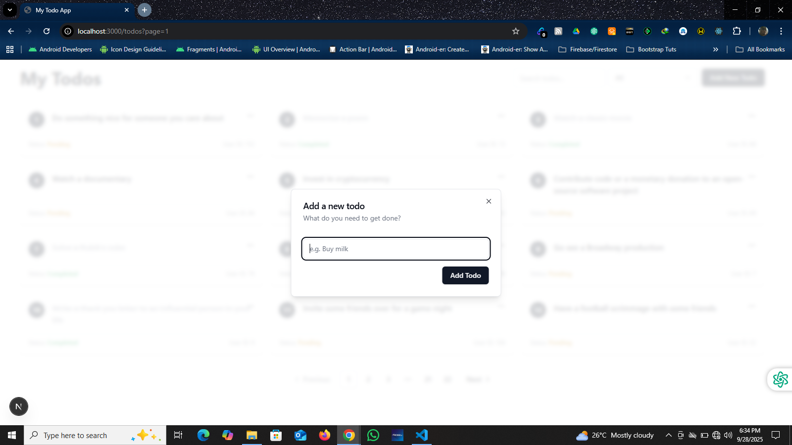
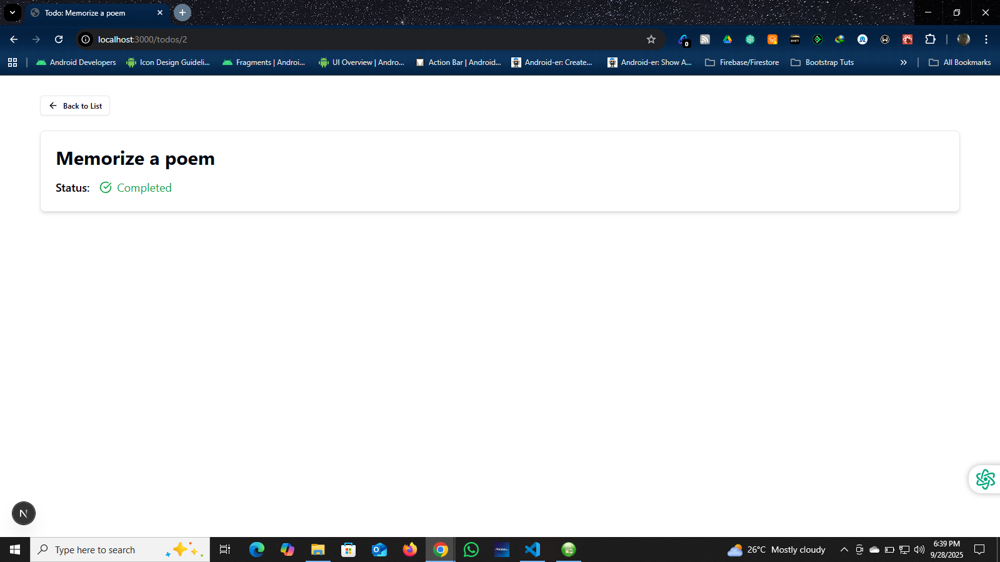
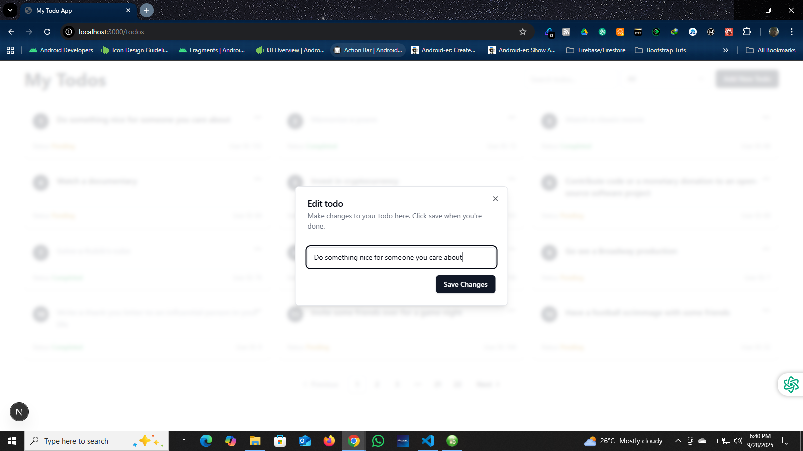
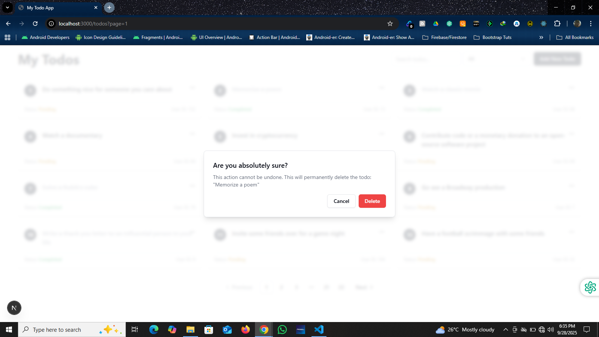
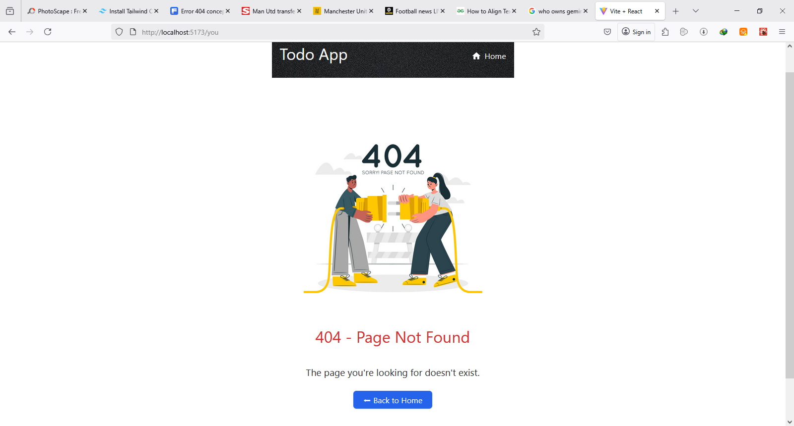

# 📝 Next.js Todo List App

This is a fully functional, accessible, and responsive Todo List app built with:

- ✅ Next.js 14 + React
- ✅ TanStack Query (React Query)
- ✅ Tailwind (via ShadCN UI for modals & buttons)
- ✅ DummyJSON API

---

## 📦 Features

- View list of todos with pagination
- Filter todos by status (completed or pending)
- Search todos by text
- View full details of each todo
- Add, edit, and delete todos using modal dialogs
- Accessible 404 page and error boundaries
- Keyboard-friendly navigation and focus styles
- Uses cache + fallback loading spinner

---

## 📂 Project Structure (Next.js)

my-todo-app-nextjs/
├── public/ (static assets like favicons)
├── src/
│ ├── app/ (App Router pages, layouts, etc.)
│ │   ├── todos/
│ │   │   └── page.tsx
│ │   └── layout.tsx
│ │   └── page.tsx
│ ├── components/ (UI components)
│ ├── lib/ (API functions, utilities)
├── next.config.mjs
├── package.json  
└── README.md (instructions, features, screenshots)

---

## 📸 Screenshots

### 📋 Todo List View



### 📋 Todo List Mobile View



### ➕ Add Todo Modal



### 📋 Todo List Details



### ✏️ Edit Todo



### ❌ Delete Todo



### 🚫 404 Page



---
## 🚀 Getting Started

```bash
git clone https://github.com/your-username/my-todo-app.git
cd todo-app
npm install # or yarn install, pnpm install
npm run dev # or yarn dev, pnpm dev
```
---

## Build

npm run build

---

## 🛠 API Integration

### 📡 API Used: [DummyJSON](https://dummyjson.com/)

The [DummyJSON](https://dummyjson.com/) API, a **free MOCK** API for testing purposes, was used in this project for its data structure, support and persistent mutations for `POST`, `PUT`, and `DELETE` operations on todos.

### ✅ API Features Used

- `GET /todos` — to fetch the full list of todos  
- `GET /todos/:id` — to fetch a single todo by ID  
- `POST /todos/add` — to add a new todo  
- `PUT /todos/:id` — to update an existing todo  
- `DELETE /todos/:id` — to delete a todo

### 🧰 Usage Context

These endpoints are consumed using **TanStack Query (React Query)** for:
- Caching
- Background updates
- Mutation handling (add/edit/delete)

Custom hooks like `useUpdateTodo`, `useDeleteTodo`, and query keys like `["todos"]` or `["todo", id]` were created to manage this integration cleanly.

---

## 🧩 Challenges Faced During Development

### 1. Tailwind CSS Integration Issues
- Initially encountered failure while running `npx tailwindcss init -p`, and even after manually creating `tailwind.config.js` and `postcss.config.js`, styles like `bg-blue-500` did not apply.
- ✅ **Resolution**: The project was fully migrated to use **Tailwind CSS** for all layout and component styling, integrated with `shadcn/ui`. This resolved initial setup issues and provided a consistent design system.

### 2. ShadCN/UI Integration Errors
- ShadCN buttons and dialogs failed due to missing the utility function `cn()` and unresolved alias `@/lib/utils`.
- ✅ **Resolution**: A `lib/utils.ts` file was created containing the `cn()` helper using `clsx` and `tailwind-merge`. The path alias was correctly configured in `tsconfig.json` to point `@` to the `src` directory.

### 3. UI Element and Layout Issues
- The **Add Todo** button disappeared after adding filters and search due to an undefined state variable (`setShowAddModal`).
- ✅ **Resolution**: The missing state and modal logic were restored, and the button was moved to its own wrapper section for better layout and visibility.

### 4. Accessibility Alignment Issues
- The checkmark (✅) and cross (❌) icons in the Todo detail page were slightly misaligned with status text.
- ✅ **Resolution**: Various CSS alignment techniques were applied. Although not pixel-perfect on all platforms, alignment was acceptable and prioritized after functionality.

### 5. 404 Page Setup
- A fallback 404 page was required with an illustration and a way to guide the user back.
- ✅ **Resolution**: A `NotFound.jsx` page was created, using an image, a descriptive message, and a ShadCN-styled “Back to Home” button.

### 6. Pagination Bug
- An error occurred when `filteredTodos` became undefined during filtering, causing the app to crash.
- ✅ **Resolution**: Added safe fallback handling (`todos ?? []`) and validated state updates to ensure pagination worked alongside filters.

### 7. Search and Pagination Logic
- Searching for an item on a different page did not navigate to the correct page.
- ✅ **Resolution**: The data fetching logic in `lib/api.ts` was optimized to use the API's fast search endpoint. The client-side logic was updated to correctly calculate the destination page and navigate, greatly improving performance and user experience.

### 8. New todos are created but can't be updated or deleted
- The DummyJSON API always one to create a new todo but won't allow one to either edit it or delete it. It was really impossible for such operations to be carried out. Several attempts to perform usch always led to an error 404 because the new todo **is not** actually saved on the API.
- ✅ **Resolution** From the DummyJSON API documentation, only the the todos which already exist on the mock API can be either edited or deleted. There's no room for such operations to be carried out on the newly created todo since the new todo isn't actually saved on the API. So we go with how the rules are written by only updating/deleting the already created todos found within the API.

---